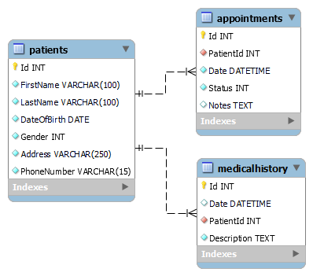

# Overview

For this project, I'm building upon my previous [Appointment Management System (AMS)](https://github.com/bykarol/appointment-management-sys) with the primary goal of integrating database functionalities. To achieve this, I have incorporated the Dapper and SQLite packages into the project. This integration was accomplished by executing the following commands: `dotnet add package Dapper` and `dotnet add package Microsoft.Data.Sqlite`.

Unlike Entity Framework, which emphasizes a code-first approach, Dapper operates differently. To work effectively with Dapper, I needed to design and create SQLite database tables tailored to store information pertinent to patients and appointments.

Following the database setup, I developed a Database Service. This helper class was crafted to manage database connections and execute queries using Dapper. This service would act as an intermediary, handling all database-related tasks and ensuring a clean separation of concerns.

Lastly, I updated the existing managers to utilize Dapper for database interactions, replacing the previous approach where data was stored in lists. Specifically, I modified the `PatientsManager` class to interact with the SQLite database through the Database Service. Future work includes applying similar modifications to the `AppointmentsManager` class, ensuring consistent and efficient database interactions across the entire system.

## [Software Demo Video](https://youtu.be/IkzxRHKUJ0I)

# Relational Database

> While SQL began as a language used to manipulate data in relational databases, it has evolved to be a language for manipulating data across various database technologies.
SQL is not an acronym for anything (although many people will insist it stands for “Structured Query Language”). When referring to the language, it is equally acceptable to say the letters individually (i.e., S. Q. L.) or to use the word sequel.
Alan Beaulieu (2020, O'Reilly Media, Inc.)

## Appointment Management System (AMS): Entity-Relationship Diagram (ERD)
     

## What is Dapper?
> Dapper is a 'micro ORM', providing lightweight, high-performance data access with minimal abstraction. It relies on SQL queries, for example, mapping the results to objects directly:
`SELECT * FROM CUSTOMERS WHERE ID = 1`    

# Development Environment

- .NET8 SDK
- Visual Studio Code
- C#
- SQLite
- Dapper

# Useful Websites

- [Dapper GitHub Repo](https://github.com/DapperLib/Dapper)
- [Dapper Intro - tutorial in spanish](https://www.youtube.com/watch?v=3eV5m56Rf3E)
- [How to use C# and .NET with SQLite](https://learn.microsoft.com/en-us/shows/on-net/how-do-i-use-csharp-and-dotnet-with-sqlite)

# Future Work

- Implement CRUD Operations for Appointments Manager